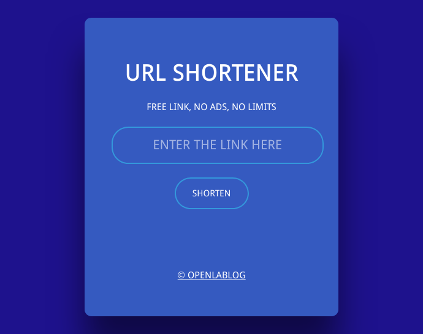

# 部署在cf workers + d1数据库的短网址生成代码

## 主要功能

1. api功能：创建短网址和删除短网址
2. 表单POST提交token鉴权，可防止机器人提交

## 部署方法

### 1、创建d1数据库：shorturl

然后创建两个数据表：url_list 和 token_list，表结构如下

**url_list 表**

| Column Name | Type | Primary Key |
| ----------- | ---- | ----------- |
| key         | text | ✔          |
| value       | text |             |

**token_list 表**

| Column Name | Type    | Primary Key |
| ----------- | ------- | ----------- |
| token       | text    | ✔          |
| time        | integer |             |

### 2、创建workers：shorturl-workers-d1

然后添加 d1数据库 绑定 workers，变量名称：shorturl_d1

### 3、上传 worker.js 代码完成部署

